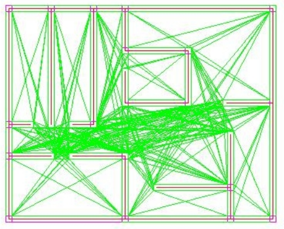
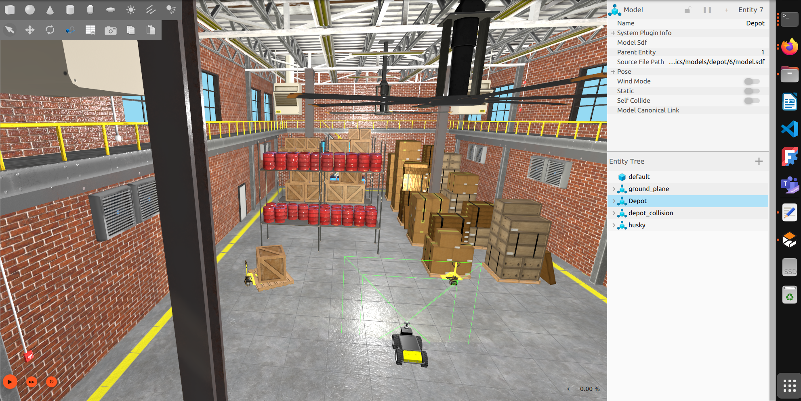

## Follow line

Esta semana la dediqué a varias cosas: aprender sobre la técnica de navegación global grafo de visibilidad, elección del mundo de Gazebo para desarrollar el proyecto y leer las instrucciones para desarrolladores de Robotics Academy.

El grafo de visibilidad es un método para lograr la navegación global en robots móviles. Con este método, a partir de un mapa de obstáculos fijos se generan nodos que conectan puntos visibles entre sí (vértices de obstáculos etc). Los nodos se conectan de tal forma que no atraviesen obstáculos y se obtiene un grafo con los posibles caminos por los que el robot puede moverse. Para evitar la colisión con los obstáculos, se implementan zonas de seguridad alrededor de los mismos. Para planificar la ruta, se usan algoritmos como el de Dijkstra y A* sobre el grafo para hallar la ruta entre el robot y el destino.

Esta técnica de navegación es útil para interiores con obstáculos fijos, y puede mejorarse con la integración de sensores para lidiar con los obstáculos móviles.

Otro punto importante que estuve tratando fue la elección de el entorno donde llevar a cabo las pruebas. Estuve viendo varios mundos de Gazebo y terminé dedidiéndome por un almacén que me gustó bastante. Quise desplegar un turtlebot y mapear el entorno para ver cómo de adecuado era para nuestro propósito, pero no hubo manera. Espero tener más suerte próxima semana.

